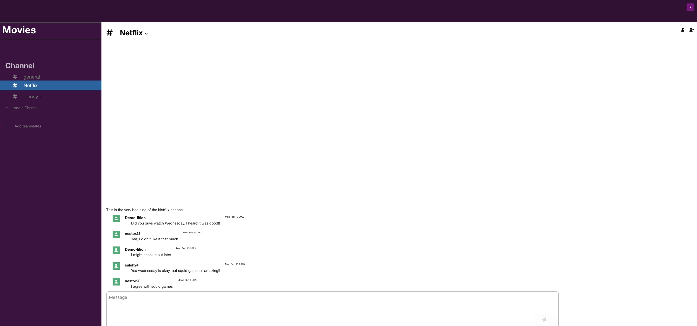
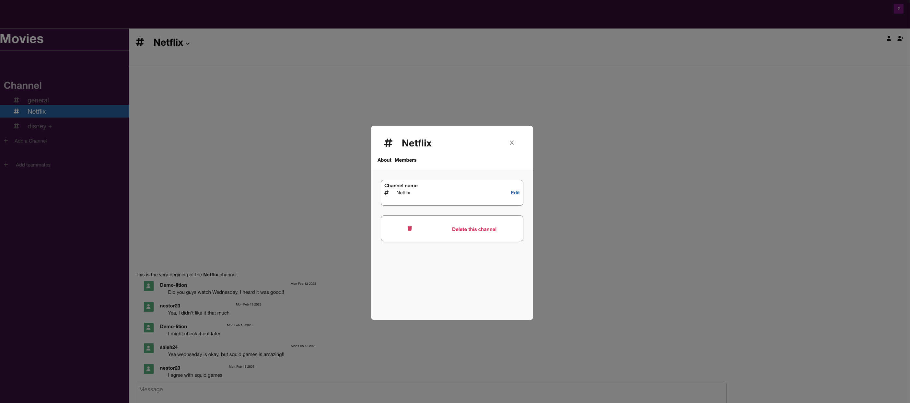

# README

# About the Project
A clone project of slack. Uses Action Cable to broadcast messages. Allows users working in the same workplace to communicate with each other via action cable.

# Link to live site
https://khakis.onrender.com

# Features
One feature I that was new to me was using action cable to the messenger app. Implementing that was difficult at first, but after understanding how to access the methods from the backend I felt like it was simpler to know how to access the database. I also learned how to broadcast the messages so that the messages show without refreshing.

<p align="center">


</p>

Another challenge I faced was creating and deleting the channels. I had issues trying to add the channel in to the database and to get a new workplace to create a general channel, but learned that the best way to do it it from the backend so that everytime it creates a new workplace it creates a general channel.

<p align="center">


</p>

# Technologies

For my message model I implemented action cables to broadcast the it's' data, so whenever the user sends a message, it displays the body of the message without having to refresh from both sides. I also used redis to host websockets on the live server. I used rails for the backend and React.js for the frontend.

# Future Features

Add direct messages to send private messages to a certain user. Group messaging, so people only within that group can
see those messages.

# Codes

## Messages Store

```javascript

export const createMessage = (message) => {
    const { sessionUserId, channel, body, isPrivate } = message
    csrfApiFetch('/api/messages', {
        method: 'POST',
        body: JSON.stringify({
            user_id: sessionUserId,
            channel_id: channel,
            body,
            private: isPrivate
        })
    })
};

export const fetchMessages = (channelId) => async (dispatch) => {
    const res = await csrfApiFetch(`/api/messages?channelId=${channelId}`)

    if (res.ok) {
        let messages = await res.json()
        dispatch(receiveMessages(messages))
        return messages

    }
}
```

## User Auth Store
```javascript
    const storeCSRFToken = response => {
    const csrfToken = response.headers.get("X-CSRF-Token");
    if (csrfToken) sessionStorage.setItem("X-CSRF-Token", csrfToken);
}

const storeCurrentUser = user => {
    if (user) sessionStorage.setItem("currentUser", JSON.stringify(user));
    else sessionStorage.removeItem("currentUser");
}

export const login = ({ credential, password }) => async dispatch => {
    const response = await csrfFetch("/api/session", {
        method: "POST",
        body: JSON.stringify({ credential, password })
    });
    const data = await response.json();
    storeCurrentUser(data.user);
    dispatch(setCurrentUser(data.user));
    return response;
};

export const restoreSession = () => async dispatch => {
    const response = await csrfFetch("/api/session");
    storeCSRFToken(response);
    const data = await response.json();
    storeCurrentUser(data.user);
    dispatch(setCurrentUser(data.user));
    return response;
};


```


